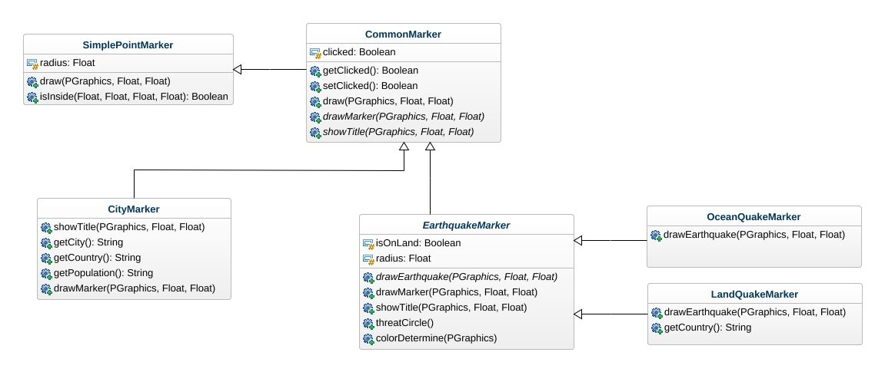
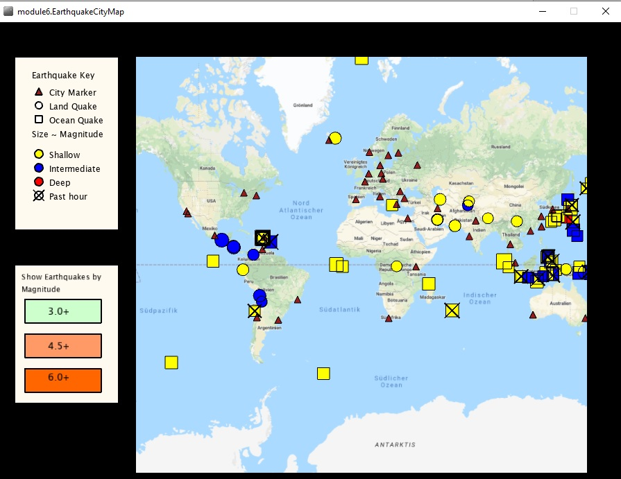

# EarthquakesMap
 A map showing recent earthquakes aroung the world. It uses Unfolding Maps.
 Unfolding is a tile-based map library. It enables you to rapidly create interactive maps.
 Developed as a part of online course "Object Oriented Programming in Java (UCSD)" provided by the website Coursera. 
 Takes the recent Earthquake Data from
 
 "https://earthquake.usgs.gov/earthquakes/feed/v1.0/summary/2.5_week.atom".
 
 UML Diagram
 
 

Screenshot from the running application.

